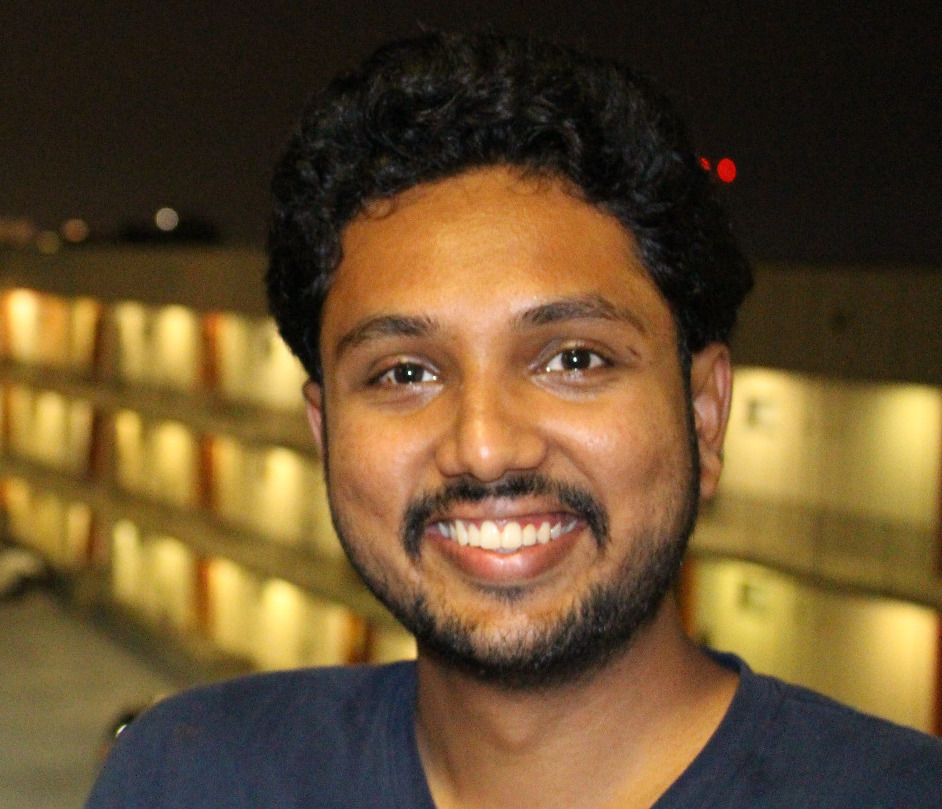

   

## About Me
I'm a PhD candidate in the School of Electrical and Computer Engineering at Georgia Tech. I'm interested in developing computational tools and machine learning algorithms to predict adverse health outcomes by analyzing clinical data. I work with [Shamim Nemati](http://nematilab.info/people/shamim/index.html)  in the Department of Biomedical Informatics at University of California San Diego.

<i class='fa fa-twitter fa-fw'></i>  [twitter](https://twitter.com/sprajw){:target="_blank"}  
<i class='fa fa-linkedin fa-fw'></i> [linkedin](https://www.linkedin.com/in/supreeth-prajwal/){:target="_blank"}  
<i class='fa fa-graduation-cap fa-fw'></i>  [google scholar](https://scholar.google.com/citations?user=BPT-V4AAAAAJ&hl=en){:target="_blank"}  
<i class='fa fa-file-text fa-fw'></i>  [resume]({{ site.baseurl }}/assets/Supreeth_Shashikumar_Resume.pdf){:target="_blank"}  
<i class='fa fa-envelope fa-fw'></i> <a id="email"></>   

---
## Education

+ Georgia Institute of Technology, Atlanta, USA, *August 2015 - Present*  
  PhD in Electrical and Computer Engineering  
  Advisor: [Shamim Nemati](http://nematilab.info/people/shamim/index.html)

+ National Institute of Technology - Karnataka, India, *August 2011 - May 2015*  
  B.Tech in Electronics and Communication Engineering

---
## Professional Experience

+ **Microsoft Research Cambridge, UK**, *May 2018 - August 2018*  
  **Research Intern**  
  Worked in the Healthcare ML team to develop interpretable models for predicting clinical outcomes of patients with Traumatic Brain Injury  
  Advisors: Pijika Watcharapichat, [Cheng Zhang](https://cheng-zhang.org/) and [Ari Ercole](http://anaesthetics.medschl.cam.ac.uk/staff/ari-ercole/)

+ **Qualcomm, Bangalore, India**, *May 2014 - July 2014*  
  **Engineering Intern**  
  Worked in the System Performance Team to review the thermal framework of Qualcomm’s flagship Snap-dragon chipsets

